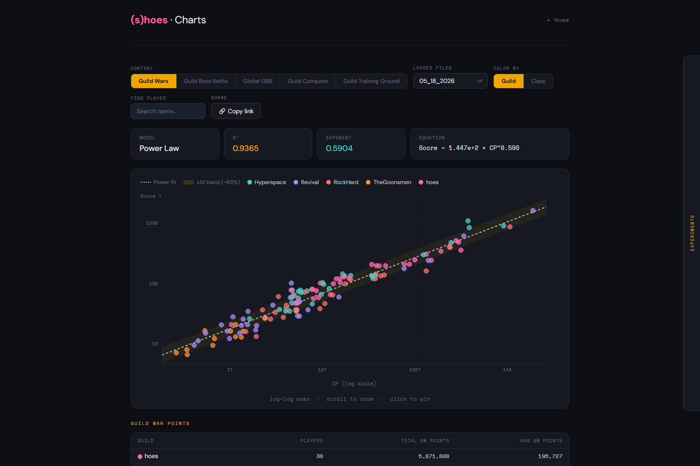
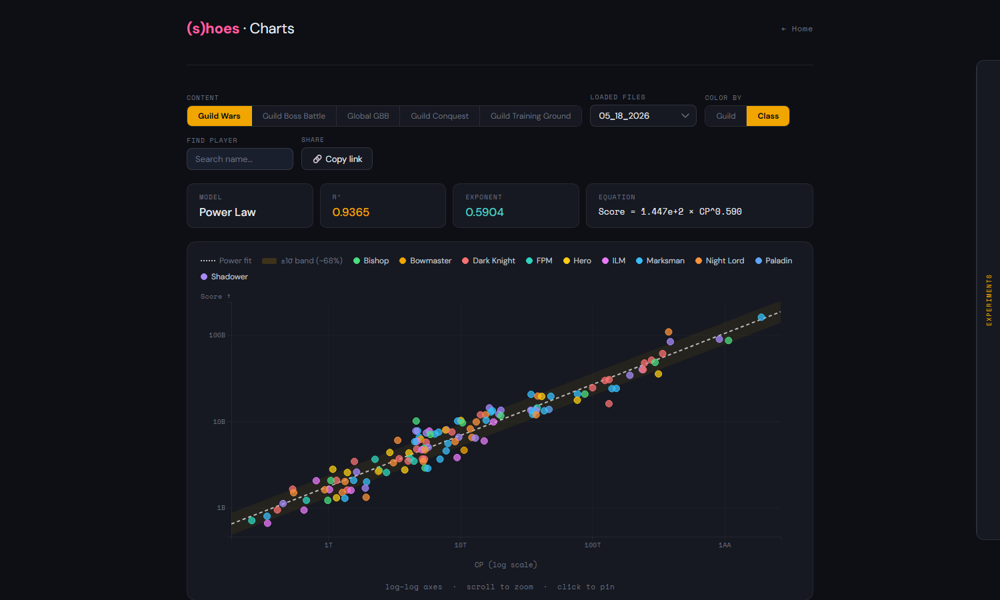
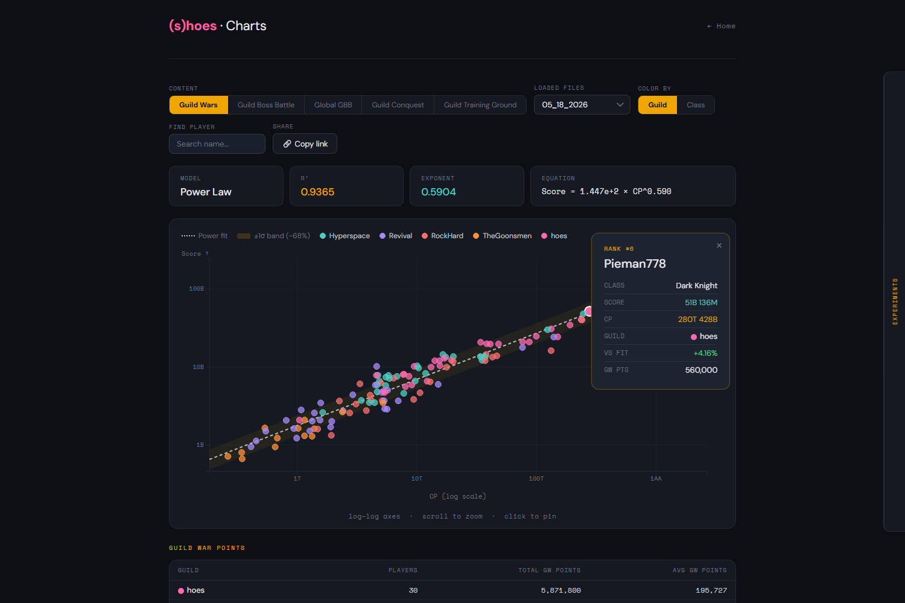
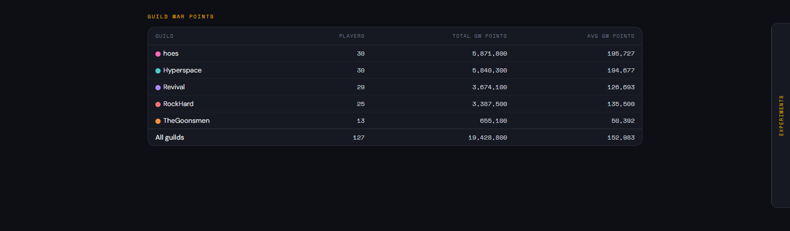
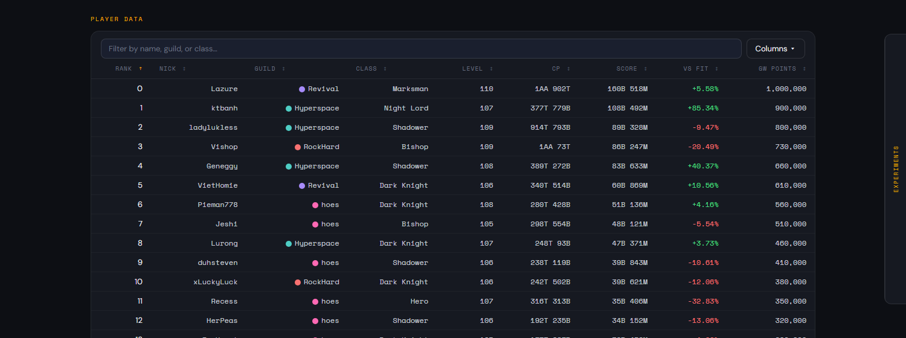
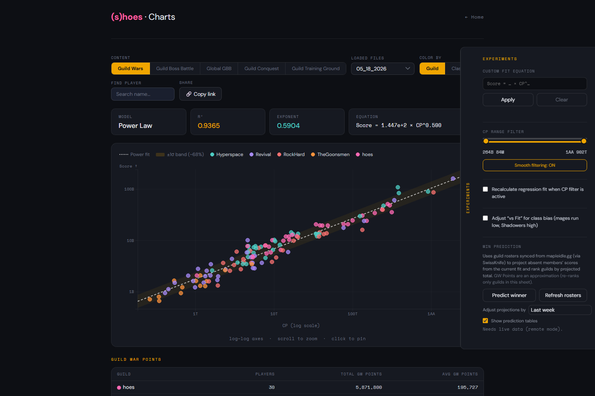
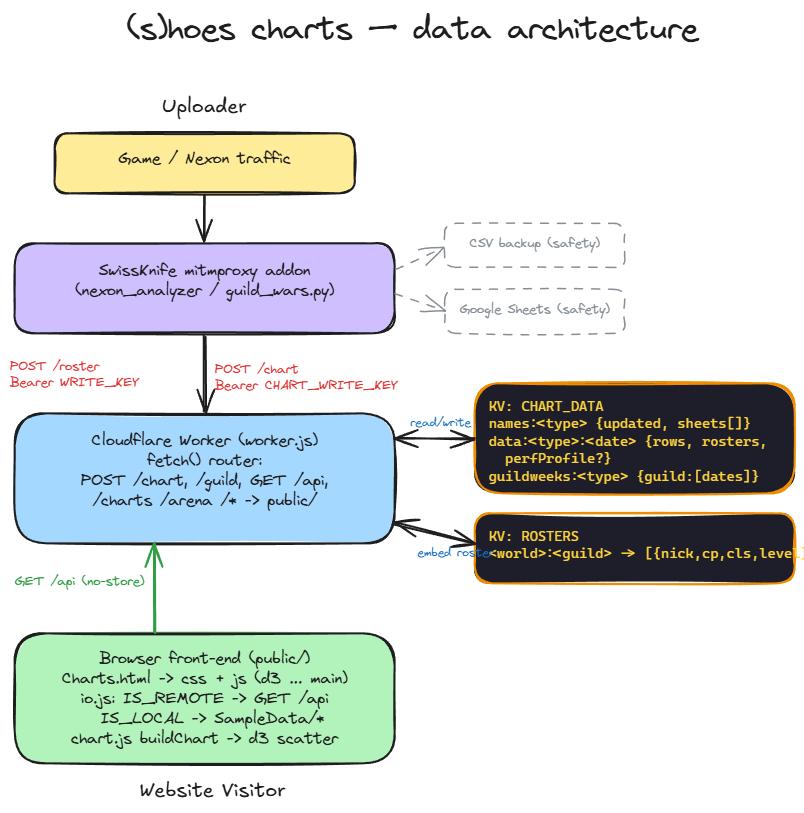

# hoes.fyi

Maplestory guild content visualizer — CP vs Score scatter plot with a power-law
regression fit. Supports Guild Wars, Guild Boss Battle, Global GBB, Guild
Conquest, and Guild Training Ground data stored in Cloudflare Workers KV, plus
an **Arena** player lookup tool.

## Chart features

The chart app (`/charts`) plots every player as **CP vs Score** on log–log axes and
fits a **power-law regression** to the cloud. The screenshots below use the bundled
sample data.

### Overview



- **Content toggle** — switch between Guild Wars, Guild Boss Battle, Global GBB,
  Guild Conquest, and Guild Training Ground.
- **Sheet (date) picker / Reload / Last updated** — pick a captured week; *Reload*
  re-reads the latest sheet from KV, and *Last updated* shows when that content
  type was last ingested.
- **Stats cards** — the fitted model: **R²** (goodness of fit), **exponent**, and
  the full **equation** (`Score = a × CP^b`).
- **Fit line + band** — the dashed power-law fit with a shaded **±1σ band (~68%)**,
  so over- and under-performers are easy to spot.
- **Zoom** — scroll to zoom into a region; a *Reset zoom* badge appears once zoomed.

### Color modes & interactive legend



Color points **by guild** or **by class**. The legend is interactive — click an
entry to isolate/highlight that group. (`hoes` is always pink; other guilds get
palette colors assigned alphabetically.)

### Player info panel



Hover a dot for its details; **click to pin** the panel. It shows rank, class,
score, CP, guild, **vs Fit** (how far above/below the regression the player sits),
and GW Points. **Find player** in the controls searches by name and jumps to the
dot, and **🔗 Copy link** produces a deep link that restores the exact view
(content type, sheet, color mode, highlights, pinned player).

### Guild pivot table



Per-guild rollup — player count plus **total** and **average** GW Points (for
Guild Wars) or Score (other content types), with an "All guilds" summary row.

### Player data table



Every player in a sortable, filterable table. Sort by any column, **filter** by
name/guild/class, and pick visible columns from the **Columns ▾** menu. Includes
**vs Fit**, optional **vs History** (this week vs the player's historical norm —
flags likely sandbaggers), and GW Points.

### Experiments panel



Slide-out panel (the **Experiments** tab on the right edge) with analysis tools:

- **Custom Fit Equation** — type your own `Score = a × CP^b` to overlay and compare
  a *vs Custom* delta.
- **CP Range Filter** — dual slider to restrict the dataset to a CP band, with a
  *Smooth filtering* toggle for large datasets.
- **Recalculate regression on filter** — refit the curve to just the filtered
  range instead of the full cloud.
- **Class-bias adjust** — correct *vs Fit* for systematic class differences (mages
  tend to run low, Shadowers high).
- **Win Prediction** — using guild rosters synced from mapleidle.gg (via
  SwissKnife), projects absent members' scores from the fit and ranks guilds by
  projected total, with a *Projected Absentees* breakdown. Needs live data
  (remote mode).

## Architecture



The front-end is a **fully static site** (`public/`) served by a Cloudflare
Worker whose `assets` binding publishes the whole `public/` tree. Chart data
lives entirely in **Workers KV** — there is no Google in the loop. The Worker
routes a few same-origin paths:

- `/api?action=...` → reads chart data from **Workers KV** (binding `CHART_DATA`).
  KV is the source of truth; responses are `no-store` (no edge-cache layer). A
  missing key returns an empty result rather than erroring.
- `/chart` (**POST**) → ingestion endpoint. SwissKnife uploads captured rankings
  here; guarded by the `CHART_WRITE_KEY` secret. Writes `data:<type>:<date>` and
  upserts the date into `names:<type>`.
- `/guild` → guild-roster KV store (binding `ROSTERS`) for the Win Prediction
  feature, also fed by SwissKnife.
- `/charts` → `Charts.html`, `/arena` → `Arena.html`
- `/userinfo` + `/userinfo/suggest` → a separate UserInfo Worker (Arena lookups)
- everything else → `public/` assets (`/` serves `index.html`)

No build step, no bundler. The chart JavaScript lives in `public/js/` as plain
(non-module) `<script src>` files that share one global scope, loaded in a fixed
order (d3 → … → `main.js` last). See `CLAUDE.md` for the per-file
responsibilities and the KV key shapes.

## Local development

Requires a local HTTP server (e.g. VS Code Live Server or `python -m http.server`
from `public/`) — opening files as `file://` blocks the `js/*.js` and sample-data
`<script>` loads.

1. Serve `public/` and open `Charts.html` over `http://localhost:...`.
2. The app detects `localhost` and uses the sample-data files in
   `public/SampleData/` automatically — no API calls or credentials needed.
3. Pick a content type from the toggle to render it (the page no longer
   auto-loads Guild Wars on open).
4. To add new sample data, add a key to `GW_LOCAL_DATA` in
   `SampleData/GWLocalData.js` (or the equivalent for the other content types).

## Data ingestion (how chart data gets in)

Chart data is captured locally by the **SwissKnife** mitmproxy addon
(`nexon_analyzer`), which reads guild-content ranking responses out of the game
traffic. For each capture it:

1. Writes a per-week, per-content-type CSV backup to its `backups/` directory
   (`<mode>_<MM-DD-YYYY>.csv`), the durable local record.
2. **Pushes** the rows to the Worker's `POST /chart` with an
   `Authorization: Bearer <CHART_WRITE_KEY>` header (and a real-browser
   User-Agent, since the site is behind Cloudflare Bot Fight Mode). The Worker
   normalizes the rows and stores them in KV.

An optional **direct Google Sheets upload** remains available in SwissKnife as a
secondary safety backup (its own OAuth creds) — the site does not read it.

KV key shapes:

- `names:<type>` → `{ updated: <ISO>, sheets: ["MM-DD-YYYY", …] }` (newest-first)
- `data:<type>:<sheet>` → bare array of `{ rank, nick, score, cls, level, cp, guild, scoreShort, cpShort }`

The `type` must be one of the `CONTENT_TYPES` in `worker.js` (mirrored by
SwissKnife's mode → content-type map in `guild_wars.py`).

## Run your own copy

To host this against your own data you need a Cloudflare Worker and the SwissKnife
capture tool. Nothing in the repo is tied to `hoes.fyi` except the values below.

**1. Configure the Worker.** Rename `name` in `wrangler.jsonc` to your Worker's
name. Create the KV namespace — `wrangler kv namespace create CHART_DATA` (plus
`--preview` for local dev) — and put the returned IDs under `kv_namespaces` in
`wrangler.jsonc`. Deploy with `npm run deploy:cf`, then set the ingestion secret:
`wrangler secret put CHART_WRITE_KEY`.

**2. Add/remove a content type** — follow the checklist in `CLAUDE.md` →
*Adding a New Content Type*: an entry in `CONTENT_TYPES` (`worker.js`), the
matching mode in `guild_wars.py`, a toggle button in `public/Charts.html`, a case
in `getLocalData()` in `public/js/data.js`, a `SampleData/<Name>LocalData.js`
file, and a line in the local boot sequence in `public/js/main.js`.

**3. Point SwissKnife at the Worker.** In the addon's Settings, set the site URL
(shared with the roster uploader) and the **Chart Write Key** to match
`CHART_WRITE_KEY`. Capture rankings, then **Push to site** (or enable auto-push).

**Arena is optional.** The `/arena` page depends on a *separate* UserInfo Worker
(the `/userinfo` proxy route, the `USERINFO_WORKER` service binding in
`wrangler.jsonc`, and the `USERINFO_READ_KEY` secret). That Worker is not in this
repo. If you don't have one, the chart still works fully — just drop the
`/userinfo` route and the `services` binding, and don't link to `/arena`.

## Deployment

**Cloudflare Worker (static front-end + KV data API)** — the only deploy target:

1. `npm run deploy:cf` (`wrangler deploy`) — `wrangler.jsonc` binds
   `main: worker.js`, `assets.directory: ./public` (publishing the whole
   `public/` tree), and the `CHART_DATA` + `ROSTERS` KV namespaces.
2. Set the `CHART_WRITE_KEY` secret (chart ingestion) and `ROSTER_WRITE_KEY`
   (roster ingestion) via `wrangler secret put`.
3. The `/userinfo` route needs the `USERINFO_READ_KEY` secret and the
   `USERINFO_WORKER` service binding for the Arena tool to work.

## Smoke test

After deploying, hit these in order:

```
https://hoes.fyi/api?action=getSheetNames&contentType=Guild+Boss+Battle
```
Should return a JSON array of `MM-DD-YYYY` date strings (empty `[]` if nothing
has been uploaded for that type yet).

```
https://hoes.fyi/charts
```
Should load the chart UI; pick a content type from the toggle to render data.

```
https://hoes.fyi/arena
```
Should load the Arena lookup tool.
