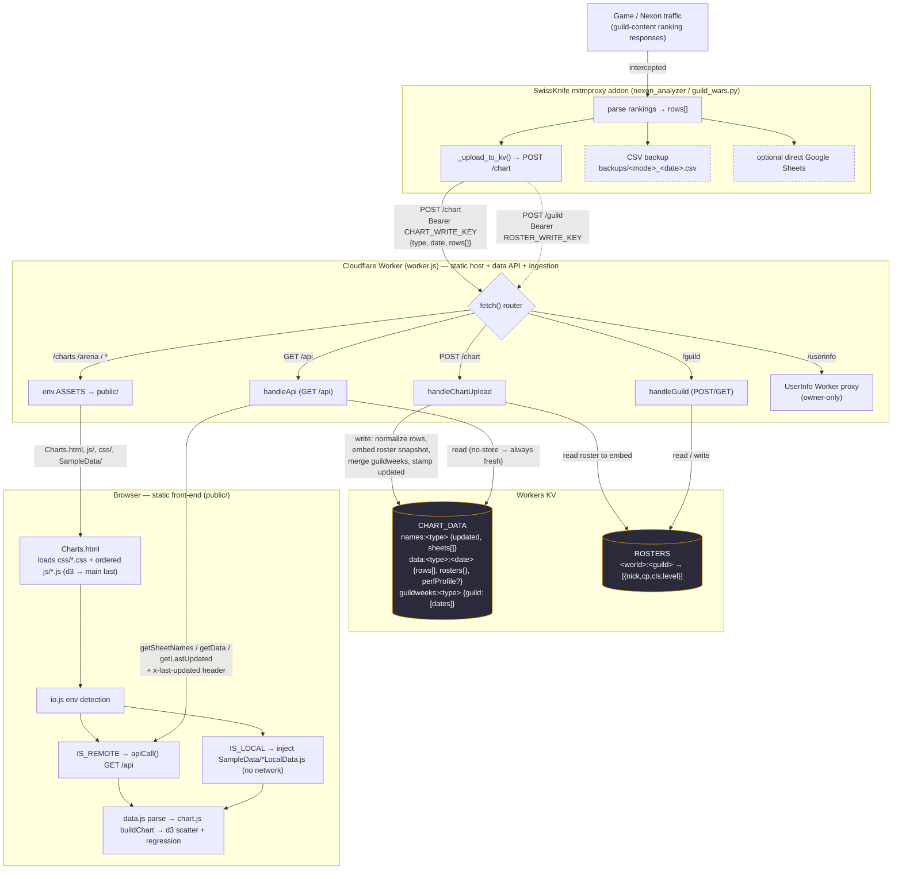

# Data Architecture

How guild-content data is captured, stored, and served for the (s)hoes Maplestory charts site.

There is **no Google in the read path** — Workers KV is the sole source of truth.
SwissKnife's CSV backup and optional direct Google Sheets upload are independent
safety copies the site never reads.

## The three data paths

**Write (ingestion).** SwissKnife reads ranking responses from game traffic →
`POST /chart` (Bearer `CHART_WRITE_KEY`). The Worker normalizes rows (drops
missing cp/score), pulls and **embeds the guild roster snapshot** from the
`ROSTERS` namespace, writes `data:<type>:<date>`, merges `guildweeks:<type>`, and
upserts the date into `names:<type>` with a fresh `updated` stamp. Rosters arrive
separately via `POST /guild` → `ROSTERS` KV.

**Read (page load).** Browser GETs `/api?action=…` → Worker reads from
`CHART_DATA` KV and serves `{ rows, rosters, perfProfile }` as-is (KV is
authoritative; a miss returns an empty result, no upstream). Responses are
`no-store`, so Reload is always fresh; the `x-last-updated` header drives the
"Last updated" display.

**Local debug.** No network — `io.js` detects `IS_LOCAL` (`file://`, `localhost`,
or no `API_URL`) and injects `SampleData/*LocalData.js` instead of calling `/api`.
